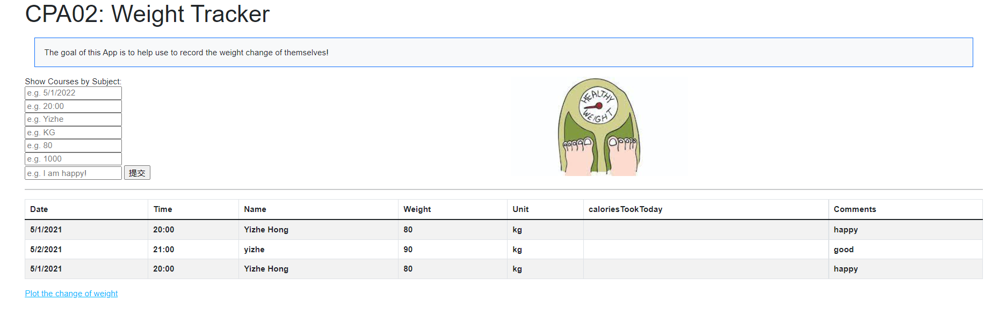
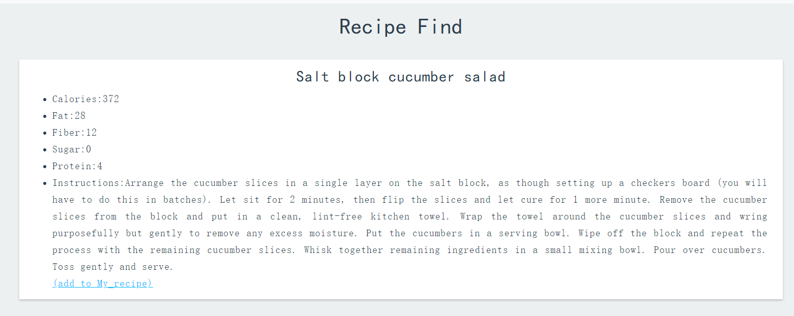
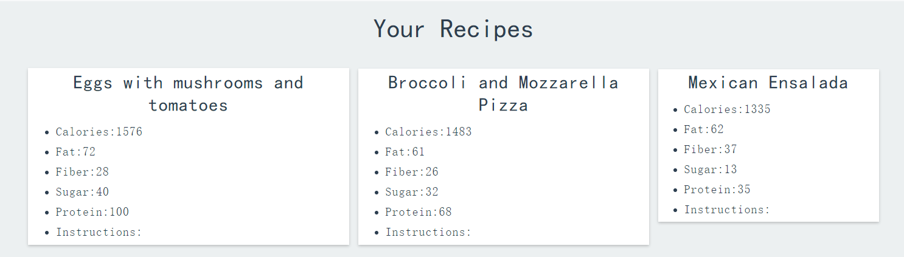

## Yizhe CPA02 Express App 

This is a simple project which can help user to track their weight 

and find healthy recipe

and store it on mongodb database

and provides access to a mongoose database in the cloud. 
It is also deployed on heroku


## Installation
Download the project from github and download nodejs and npm from https://nodejs.org
and cd into the folder

Install the packages with
``` bash
npm install
```
Start the project with
``` bash
node app.js
```
or install nodemon (the node monitoring app) with
``` bash
npm install -g nodemon
```
and start the project with
``` bash
nodemon
```
Or 
``` bash
npm start
```

## App Demonstration:
Here is a link to a moive showing how you can use our app: 
https://brandeis.zoom.us/rec/share/nm4lvaNA4hSRxx4kA0ORL3CT1m7IwZSUprGazovmFvqmCMfjlPgBnxOzL5eOGHkL.pFITgjxd3hnfkmcJ?startTime=1651788661000
## Deployed on Heroku:
https://nameless-sands-76590.herokuapp.com/


